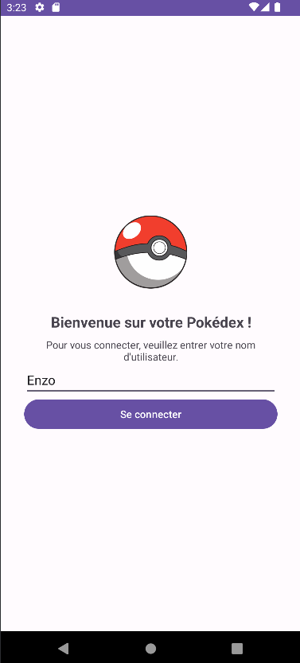
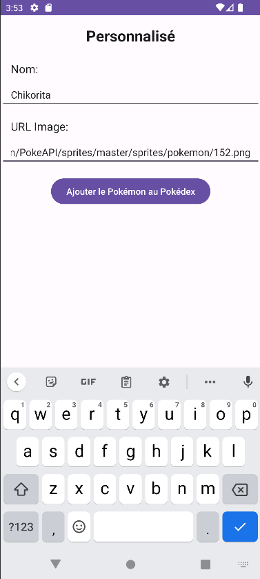
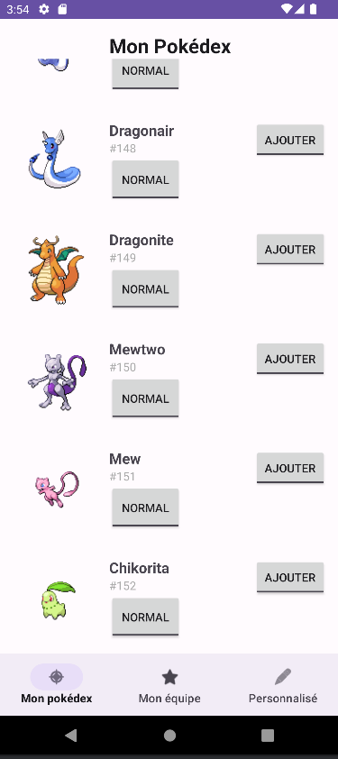

# MOBILES DEVICES POKEDEX  PROJECT 

For this project, we code an application in kotlin which is a pokemon app where you can see your pokedex and add pokemon in your team and also add pokemon to your pokedex. 

First we have a login page where you have to put your pseudo as you can see in the image below

When you are login with choosing your pseudo, you arrive to the first page the pokedex. You can see the name of the pokemon, its image, the button "normal" for changing the pokemon into his shiny appearence and the button "add" to add the pokemon to your team.

Next we have second page, your pokemon team. When you click on the team, it display the pokemon that you choose to add from your pokedex. Here for the example we add venusar and charizard

 

The third and the last page is the "personnalized". You can add here the pokemon you want to your pokedex within enter the name and the url image of the pokemon. Here we add the pokemon called Chikorita in the pokedex. 

 

Furthermore, we can use our application without wifi-connection. If you already launch the application once time with the wifi, it will stocked all the data in the cache. When you relaunched the application without internet, it will launched all the data from the cache file. 
