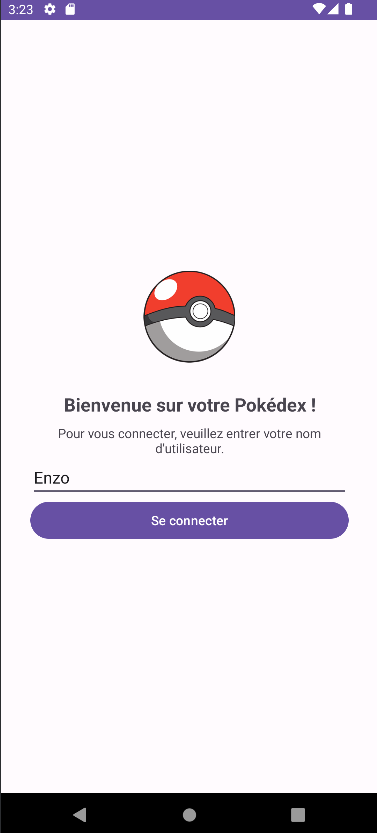
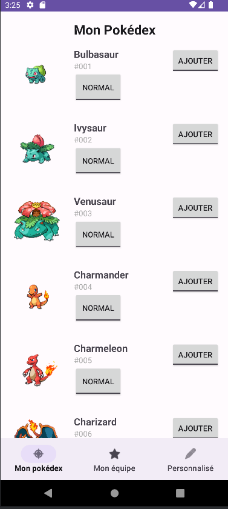
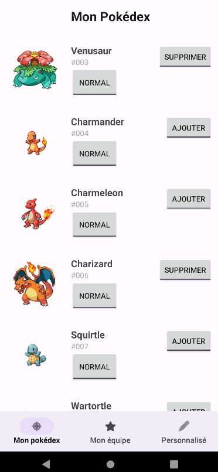
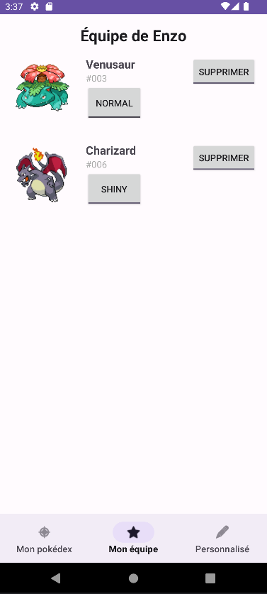
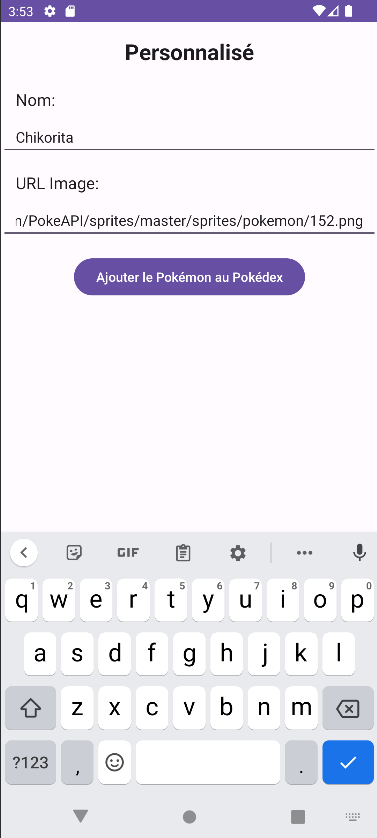
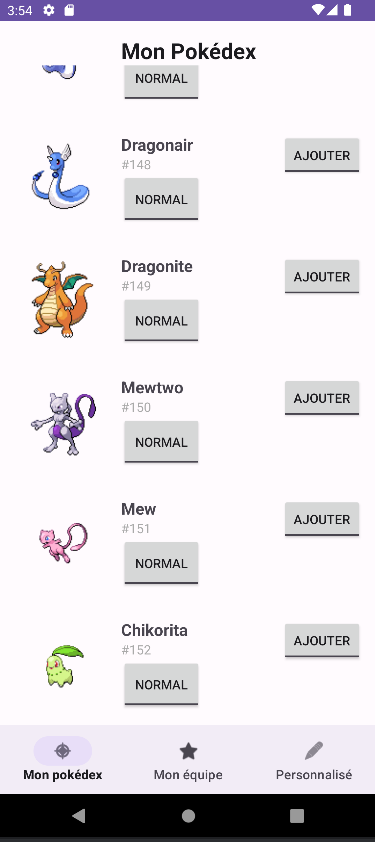
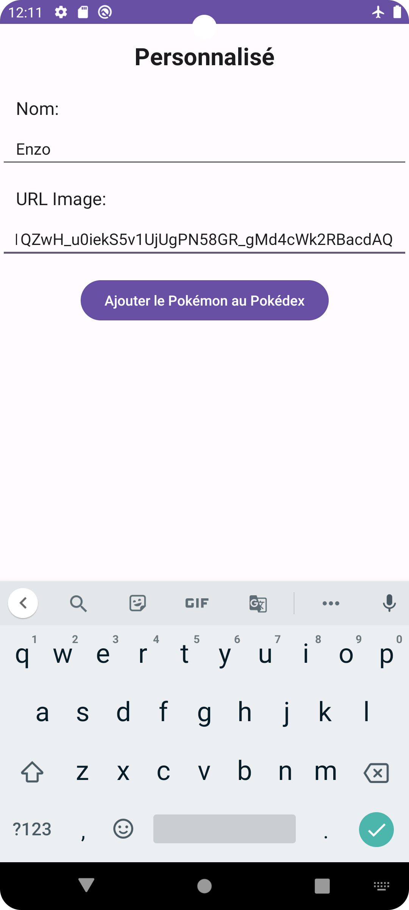
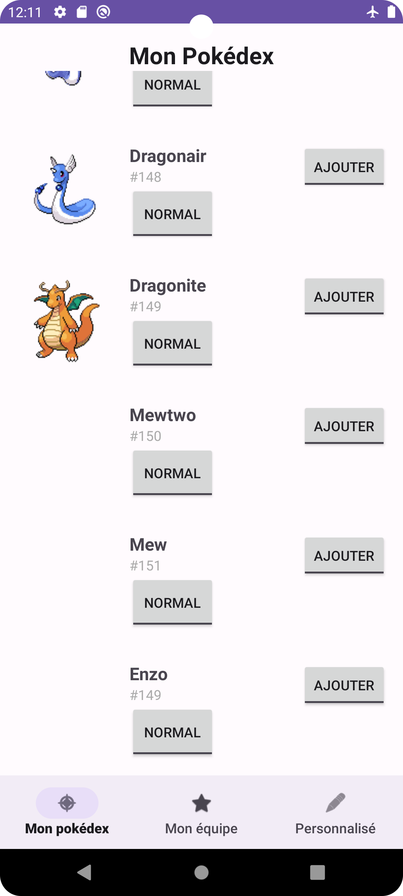
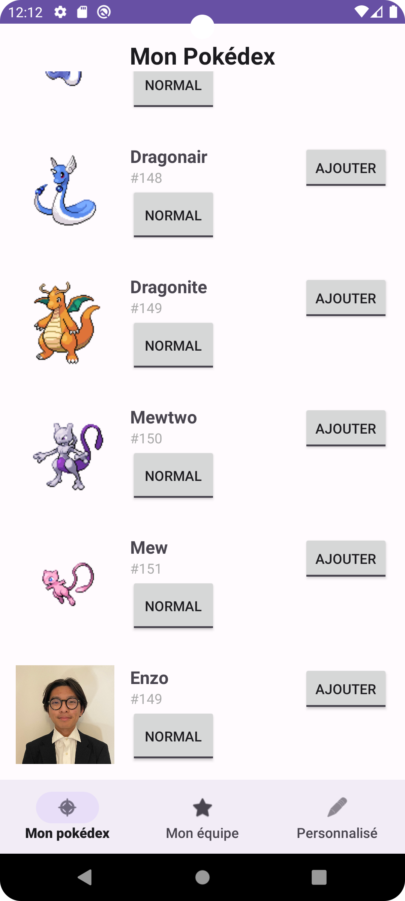

# Mobile Devices (MESIIN476323)
## Pokedex Project (ESILV A4 S7) [](https://choosealicense.com/licenses/mit/) [](https://pokeapi.statuspage.io/)

This project was done as part of our course in Android mobile development at ESILV. We were instructed to create a project, with an API of our choice, which also had to work without connection. We had to set up navigation and use shared preferences.
## Authors

- Elias TOURNEUX ([@eliasto](https://www.github.com/eliasto))
- Enzo YANG ([@Yenzago](https://www.github.com/Yenzago))
- Yann VILLELLAS ([@yannvillellas](https://www.github.com/yannvillellas))
- Sylvain XUE ([@NewSwede](https://www.github.com/NewSwede))

## Demonstration

For this project, we developed an application in Android with Kotlin. It's a Pokémon app where you can see your pokedex and add pokemon in your team. You can also add custom pokemons to your pokedex.

### Login and pokedex

First, we have a login page where you have to put your username.



When you are logged, you are redirected to the app first page: the pokedex. You can see the name of the pokemon, its image, the toggle button "normal" (to switch the pokemon into its shiny version) and the button "add" (to add the pokemon to your team).



### My team

Next we have our second page: your pokemon team.

When you click on the team, it displays the pokemon that you choose to add from your pokedex. Here for the example we added Venusar and Charizard.

 

### Custom pokemons

The third page is to create custom pokemons.

You can add here the pokemon you want to your pokedex by entering the name and the image URL of the pokemon.

Here we added the pokemon called Chikorita in the pokedex.

 

### Works without internet

Furthermore, we can use our application without any internet connection. Indeed, if you had launched the application previously with internet, it will saved all the data in the cache.

When you relaunch the application without internet, it will used all the data from the cache file.

As you can see on the images when I added a pokemon without internet, it doesn't display the image of the Pokemon in the Pokedex for example, since we don't have any internet, but the pokedex is still visible.

 

When the phone is reconnected to the Internet, if you reload images by changing page or changing to shiny image, it load all the images that were not aloready loaded.




## Running Tests

To run tests, run the following command

### Local unit tests

```bash
  ./gradlew test
```

### Instrumented unit test

```bash
  ./gradlew connectedAndroidTest
```


## Support

For support, please email babylone@eliqs.dev.


## License

[MIT](https://choosealicense.com/licenses/mit/)

This project uses [pokeapi.co](https://pokeapi.co/), which use their own license. We are not affiliated to **The Pokémon Company**, or **PokéAPI**. All images are the rights of their owners.

Pokémon and Pokémon character names are trademarks of Nintendo.
